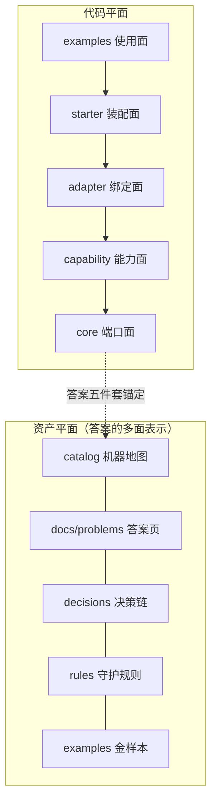
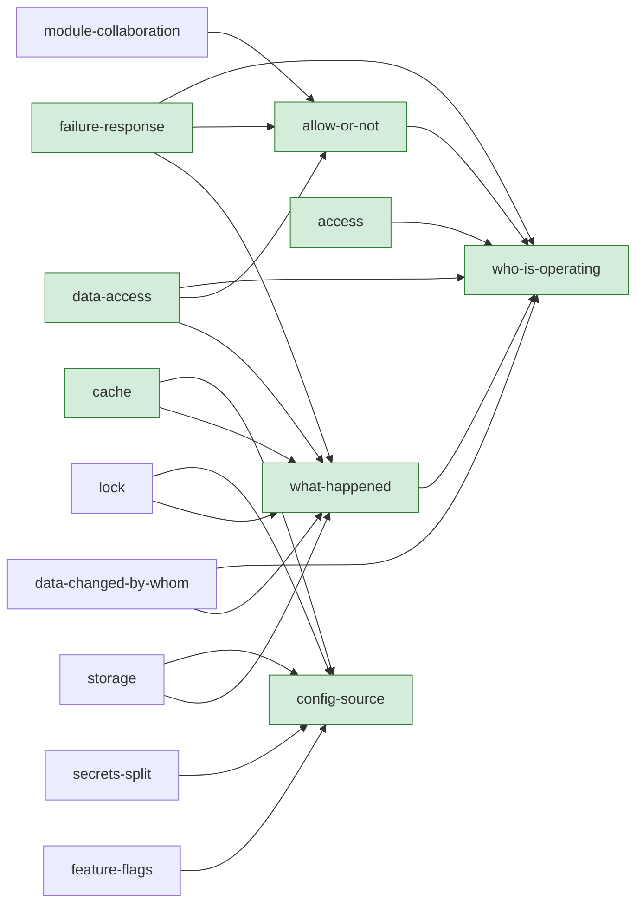

# 架构状态（4R 四图）

> 自动生成（`java scripts/ExportArchitecture.java`），勿手改。数据源：catalog/problems.json + 边界规则测试。

## Rank——顶层结构（双平面）

覆盖度：**8 / 20** 已答（管道题 14 条，能力题 6 条）。

## Role——各区职责与状态

| id | 面 | 档 | 状态 | 问题 |
|---|---|---|---|---|
| config-source | pipeline | always | ✅ answered | 配置值从哪来？ |
| who-is-operating | pipeline | always | ✅ answered | 谁在操作？代表谁（租户）？这次调用的链路标识是什么？ |
| allow-or-not | pipeline | always | ✅ answered | 这次访问（或出站调用）允许吗？ |
| what-happened | pipeline | always | ✅ answered | 发生了什么，怎么记录？ |
| failure-response | pipeline | always | ✅ answered | 操作失败了，怎么向调用方交代？ |
| who-cares | pipeline | conditional | ⬜ open | 谁关心这个事件？ |
| duplicate-request | pipeline | conditional | ⬜ open | 同一请求来两次怎么办（幂等）？ |
| data-changed-by-whom | pipeline | conditional | ⬜ open | 数据被谁改的、能回放吗（审计）？ |
| module-collaboration | pipeline | conditional | ⬜ open | 模块间怎么协作？ |
| transaction-boundary | pipeline | conditional | ⬜ open | 事务边界在哪，提交后做什么？ |
| data-access | capability | conditional | ✅ answered | 业务数据怎么读写（审计字段、租户隔离、数据权限）？ |
| identity | capability | conditional | ⬜ open | 操作者身份怎么解析与建模（身份源、操作者模型）？ |
| access | capability | conditional | ✅ answered | 访问判定的成套答案（判定链用法 + 权限类 Guards） |
| cache | capability | conditional | ✅ answered | 怎么缓存（可观测、可替换：进程内 / Redis）？ |
| lock | capability | conditional | ⬜ open | 并发互斥怎么锁（进程内 / Redis / ZooKeeper）？ |
| storage | capability | conditional | ⬜ open | 对象存储怎么用（本地 / S3 / MinIO）？ |
| secrets-split | pipeline | conditional | ⬜ open | 秘密管理是否独立成问（与普通配置分离）？ |
| feature-flags | pipeline | conditional | ⬜ open | 特性开关怎么管理？ |
| input-validation | pipeline | conditional | ⬜ open | 进来的数据可信吗（入参验证的位置与标准做法）？ |
| api-contract | pipeline | conditional | 📝 drafted | 服务对外暴露了什么（对外 API 表达）？ |

## Relation——答案依赖图

（AI 学习路径：沿箭头方向先学依赖根；答案级爆炸半径：改动被依赖多的节点前先看下游）

## Rule——守护规则清单

| 规则 | 守什么 |
|---|---|
| `core_` | core 是端口面+调度机制，零框架依赖（ADR-002/ADR-003）；中间件只准出现在 adapter 层 |
| `internal_` | internal 只经 api 的工厂方法触达（GLOSSARY）；examples 与未来模块只准用 api/spi/model |
| `./mvnw verify` | 编译 + 测试 + 边界规则一条命令（AGENTS.md 完成判据） |
| `java scripts/ExportArchitecture.java` | 本视图的再生成（catalog 变更后跑） |
